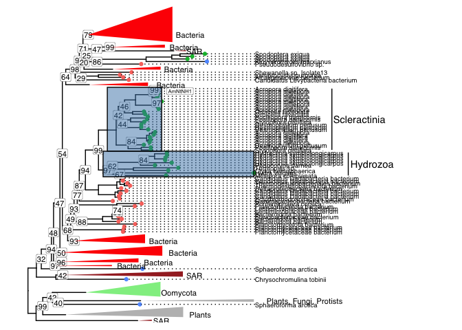

Hydrolase Tree
================

## Sequences

To track the evolutionary history of NN-Hydrolases in corals we started
with the sequence `Cluster012104` which has been cloned from coral
tissue.

``` bash
>1.2.16853.m1_Cluster012104
MKILIVVQLLFCVFPATNACSEIRVTAEDKSVIVGRTSDLGKDMFSNVVVEPEGYSRVAVPAEGCSHHEPLLSWQNKYAVAYLDAWDQFLSADGMNSAGLSVSSLMFSPFTKYQDVPPDKCGQAVSQLEFGLWLLGTFSTVQEVRKSMEEEWFPLVFPRTFQGYLFEEHFSVVDKTGDAIVIEYTEQGRKVYNNTLGVLTNSPNYEFQMLNIRNYIELSKYERDPLELGGHKFPRFGAGSGLLGMPGDFTPPSRFVRALFLKEFATQPKTSKEAVNLAFHVLNSVDIPVGVASVGKTEPDSDYTQWTVAKDLTNNALYFRDYNDMTIRVVYLDKVQQGQVLRMKAYGPITGFKDVTGELEPVYPNKEEL
```

BLASTP searches against the NCBI nr database were used to retrieve
related sequences in three ways.

1.  Eukaryotic matches only
2.  Non Eukaryotic matches
3.  Matches regardless of taxa.

These searches were run allowing a maximum of 500 hits. This maximum was
reached whenever we allowed for non-eukaryotic matches (ie bacteria) but
only 300 hits (only 184 with evalue\<1e-10) were returned for Eukaryotic
matches only. Checking the overlap of these searches revealed that the
unrestricted search (option 3 above) returned 470 bacterial matches and
only 30 Eukaryotic. In order avoid swamping the results with bacteria we
proceeded by combining results from the separate searches.

``` bash
blastp -remote -db nr -query ../Hydrolase_Sequences_OIST_JCU/Amino_acids/Cluster012104_hydrolase_cloned_aa.fasta -outfmt '6 std staxid ssciname' -max_hsps 1 -entrez_query 'Eukaryota [ORGN]' > blastp_results_euk.tsv

blastp -remote -db nr -query ../Hydrolase_Sequences_OIST_JCU/Amino_acids/Cluster012104_hydrolase_cloned_aa.fasta -outfmt '6 std staxid ssciname' -max_hsps 1 -entrez_query 'NOT Eukaryota [ORGN]' > blastp_results_noneuk.tsv

blastp -remote -db nr -query ../Hydrolase_Sequences_OIST_JCU/Amino_acids/Cluster012104_hydrolase_cloned_aa.fasta -outfmt '6 std staxid ssciname' -max_hsps 1 > blastp_results_both.tsv
```

Next we combine sequences obtained via BLASTP with curated sequences
from *A. digitifera*, *A. millepora*, *S. pistillata*, as well as
Hydroids. Curated sequences are in the file
`hpc/hydrolase_tree/known_seqs.fasta`.

``` bash
cat known_seqs.fasta blastp_combined.fasta > aa.fasta
```

Some duplicate sequences are present due to inclusion from multiple
methods. We found these using cd-hit with

``` bash
cd-hit -c 0.99 -G 1  -U 10 -i aa.fasta -o aa_clusters
```

Then report them with

``` bash
cat aa_clusters.clstr | awk 'BEGIN{n=-1;cn=NULL;members=""}/Cluster/{print cn,n,members;cn=$0;n=0;members=""} !/Cluster/{n+=1;members = sprintf("%s;%s",members,$3)}' | sed 's/\.\.\.//g' | awk '$3>1{print $4}' | grep -v '*' | sed 's/>//g' > ident.txt
```

# Alignment

Retained sequences were then aligned using highly sensitive settings
with MAFFT.

Note that MAFFT settings were chosen based on the fact that we know
little about these sequences which suggests the
[genafpair](https://mafft.cbrc.jp/alignment/software/algorithms/algorithms.html#GLE)
setting

``` bash
cat retained_seqs.tsv | xargs -I{} samtools faidx aa.fasta {} > aa_retained.fasta

mafft --maxiterate 1000 --genafpair aa_retained.fasta > aa_retained_align.fasta
```

Next we masked positions with more than 50% missing bases and export the
alignment to a fasta file.

Run IQ-Tree on the masked alignment

``` bash
iqtree -s aa_retained_align_masked.fasta -m TEST -bb 1000 -nt 2
```

<!-- -->

Figure X: Maximum likelihood tree for NN-Hydrolases in corals and
outgroup taxa. Tree includes all sequences obtained as BLASTP hits to
the nr database for Eukaryotes only (189 sequences) and Bacteria (401
sequences). Large outgroup clades are collapsed and scaled to 10% of
their original size. All nodes have \>95% branch support unless
otherwise shown (ie node labels show less supported clades).
