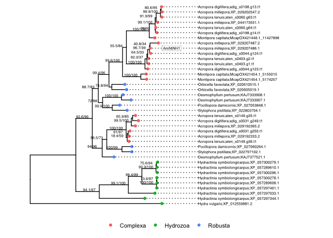

Coral hydrolase tree
================

To explore the evolutionary history of AmNtNH1 we extracted homologous
sequences from the following species.

Species included: *Acropora millepora*, *Acropora digitifera*,
*Orbicella faveolata*, *Desmophyllum pertusum*, *Stylophora pistillata*,
*Pocillopora damicornis*, *Hydra vulgaris*, *Hydractinia
symbiolongicarpus*, *Acropora tenuis*, *Montipora capitata*.

These species were chosen because they have available whole-genome
sequences from which relatively complete gene sets could be derived, and
because they capture major lineages with AmNtNH1 genes.

Homologous sequences were retrieved from predicted protein sets using
blastp with the cloned AmNtNH1 sequence as a query.

``` bash
>1.2.16853.m1_Cluster012104
MKILIVVQLLFCVFPATNACSEIRVTAEDKSVIVGRTSDLGKDMFSNVVVEPEGYSRVAVPAEGCSHHEPLLSWQNKYAVAYLDAWDQFLSADGMNSAGLSVSSLMFSPFTKYQDVPPDKCGQAVSQLEFGLWLLGTFSTVQEVRKSMEEEWFPLVFPRTFQGYLFEEHFSVVDKTGDAIVIEYTEQGRKVYNNTLGVLTNSPNYEFQMLNIRNYIELSKYERDPLELGGHKFPRFGAGSGLLGMPGDFTPPSRFVRALFLKEFATQPKTSKEAVNLAFHVLNSVDIPVGVASVGKTEPDSDYTQWTVAKDLTNNALYFRDYNDMTIRVVYLDKVQQGQVLRMKAYGPITGFKDVTGELEPVYPNKEEL
```

BLAST was run for each species as follows

``` bash
blastp -db $species.faa -query Cluster012104_hydrolase_cloned_aa.fasta -outfmt '6 std staxid ssciname' -max_hsps 1 -evalue 0.00001 > ${species}_blastp_results.tsv
```

These blast results were then processed using scripts
[02.find_loci.sh](hpc/hydrolase_tree_cnidarians/02.find_loci.sh) and
[03.extract_seqs.sh](hpc/hydrolase_tree_cnidarians/03.extract_seqs.sh)
to extract sequences.

We then aligned these sequences using MAFFT as follows

``` bash
mafft --maxiterate 1000 --genafpair hydrolases.faa > hydrolases_aligned.faa
```

Cleaned alignments to remove positions with less than 50% alignable
sequences

``` bash
cat hydrolases_aligned.faa | goalign clean sites -c 0.5 --char '-' > hydrolases_aligned_cleaned.faa
```

Built a tree using IQ-Tree

``` bash
iqtree -s hydrolases_aligned_cleaned.faa -m TEST -bb 1000 -alrt 1000 -nt 2
```

<!-- -->
